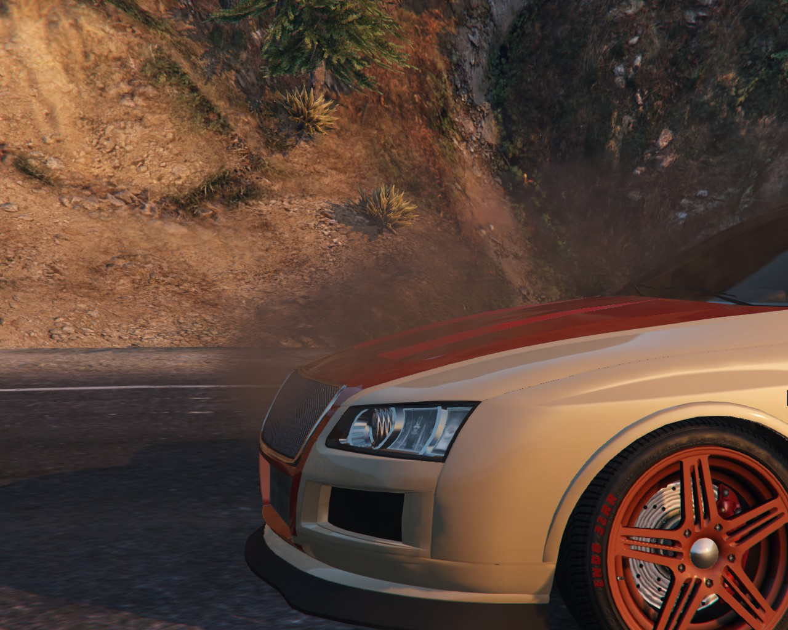
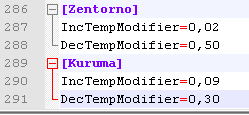

# EngineOverheat-GTA5
[](https://ci.appveyor.com/project/IncoCode/engineoverheat-gta5/branch/master)



This mod adds a little bit realism in GTA 5. When you push your car too hard and too fast the car engine gets overheated. When it's happened your engine starts smoking and will disabled. You should wait a some time until the engine has cooled.

[Download at gta5-mods.com](https://www.gta5-mods.com/scripts/engineoverheat)

Requirements 
--------------

- [Microsoft .NET Framework ≥ 4.5.2](https://www.microsoft.com/download/details.aspx?id=30653);
- [Microsoft Visual C++ Redistributable for Visual Studio 2015  (x64)](https://www.microsoft.com/download/details.aspx?id=48145);
- [Script Hook V](http://gtaforums.com/topic/788343-script-hook-v/);
- [Community Script Hook V .NET ≥ v2.5.1](https://github.com/crosire/scripthookvdotnet/releases/tag/v2.5.1).

How to install
--------------

Place the **.dll** and **.ini** files into your "**scripts**" folder, located in the main GTA V directory. If it doesn't exist, create it.

How to change an overheat modifier for car
-------------------------------------------
Open **EngineOverheatVehicle.ini** file, find desired car and change modifiers.

How to add a new overheat modifier for car
-------------------------------------------
Open **EngineOverheatVehicle.ini** file and add a new section with modifiers. For example, to change default modifiers for _Kuruma_ add the following text in the bottom of the **EngineOverheatVehicle.ini** file:
```ini
[Kuruma]
IncTempModifier=0,09
DecTempModifier=0,30
```


The list of vehicle hash can be found [here](https://github.com/crosire/scripthookvdotnet/blob/dev/source/VehicleHashes.hpp#L7).

Default overheat modifiers
--------------------------
```ini
IncTempModifier=0,07
DecTempModifier=0,35
```

Changelog
--------------
v1.0.3
- Fixed a bug related to disable gauges feature.

v1.0.2
- Fixed bug with Franklin's Buffalo.

v1.0.1
- New overheat formula;
- Different modifiers for different cars;
- Display engine health gauge on screen.

v1.0.0
- First version.
